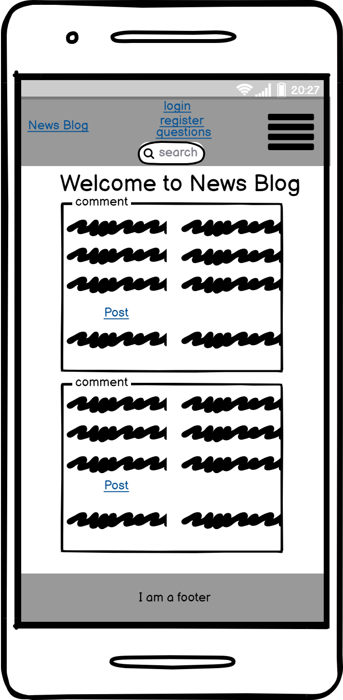
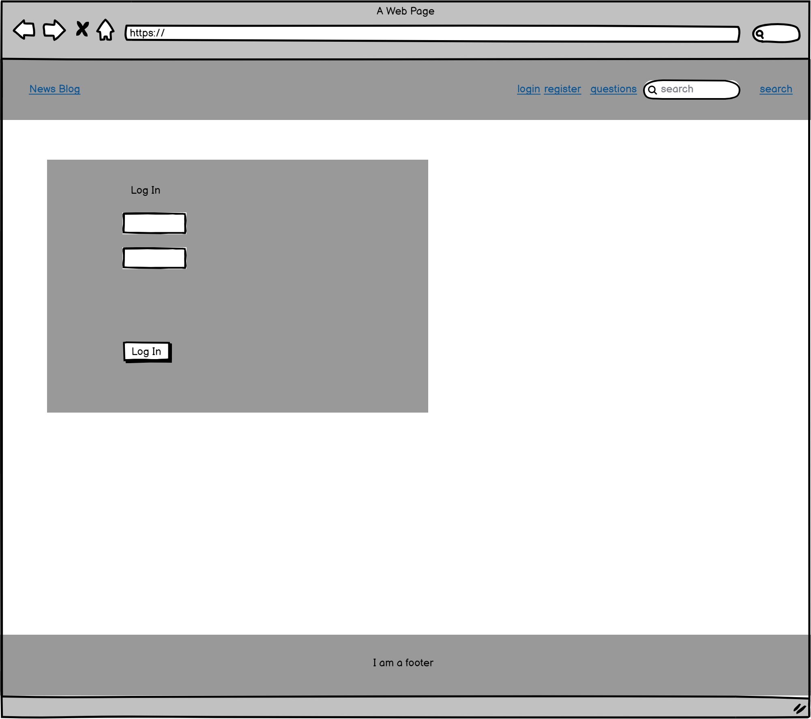
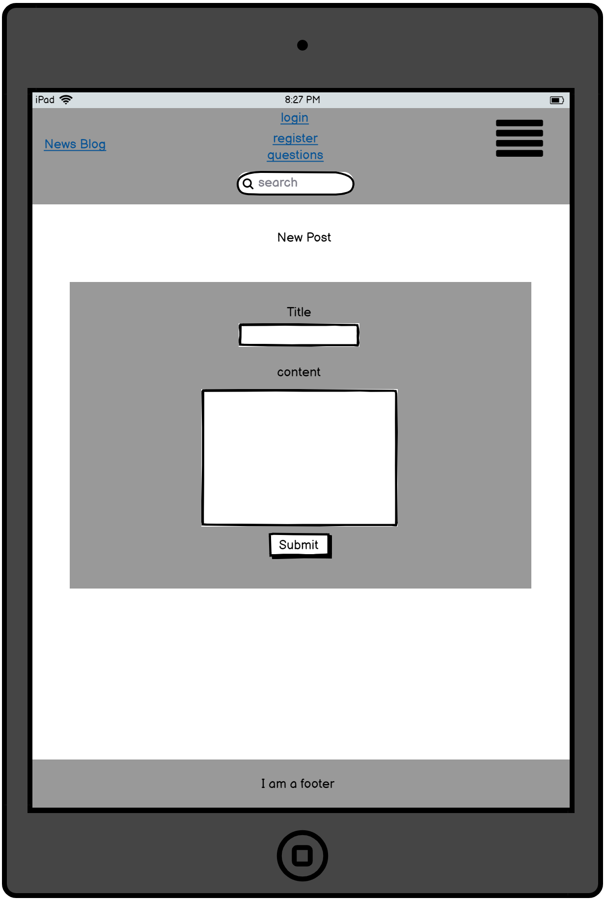
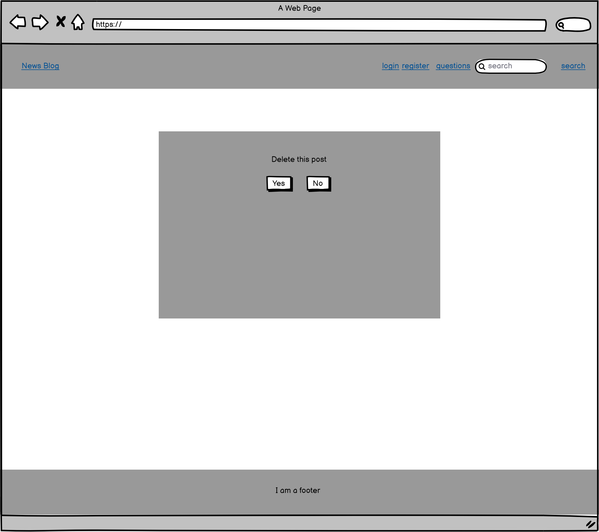
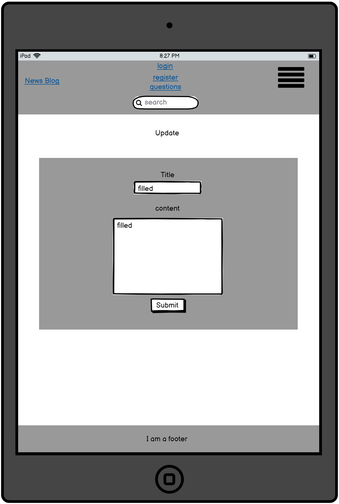
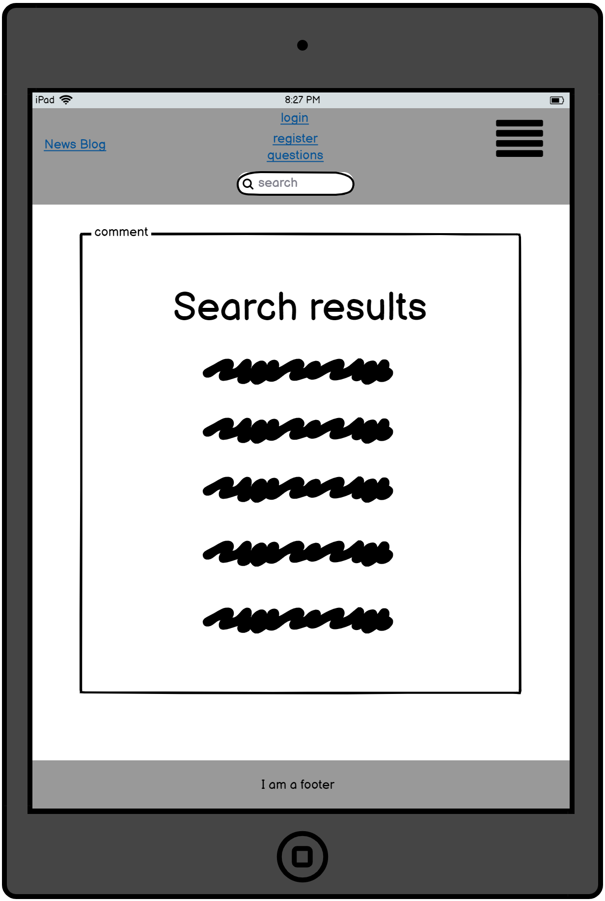
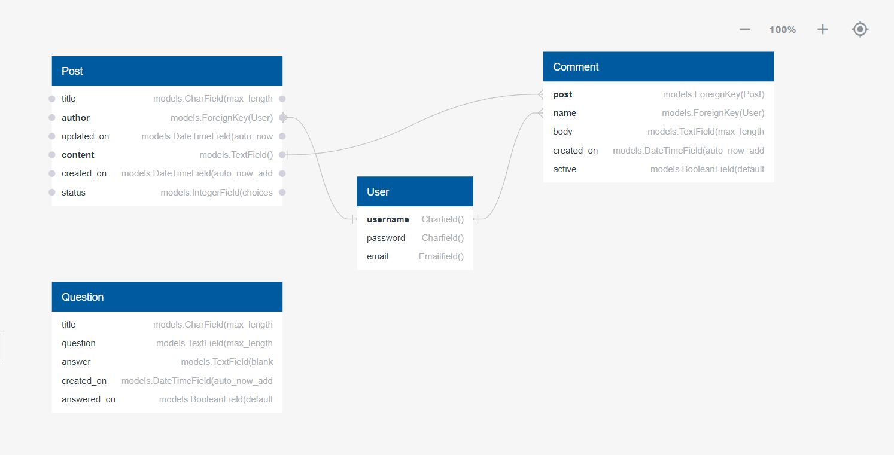
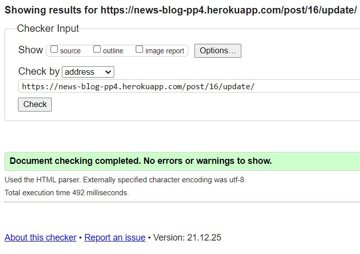
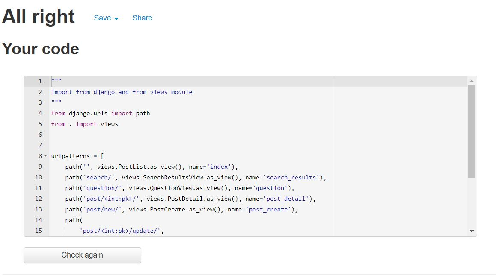

# News Blog

## Welcome to my Site [News Blog](https://news-blog-pp4.herokuapp.com/)!

 

<!-- markdown-toc start - Don't edit this section. Run M-x markdown-toc-
refresh-toc -->

# Table of Content

1. [Project goals](#project-goals)

2. [User experience](#user-experience)

    1. [Target audience](#target-audience)

    2. [User stories](#user-stories)

    3. [Design](#design)

    4. [Technical design](#technical-design)

        1. [Wireframes](#wireframes)

        2. [Database diagram](#database-diagram)

3. [Features](#features)

4. [Technologies used](#technologies-used)

    1. [Languages](#languages)

    2. [Libraries and programs](#libraries-and-programs)

5. [Testing](#testing)

    1. [HTML](#html)

    2. [CSS](#css)

    3. [Python](#python)

    4. [Accessibility](#accessibility)

    5. [Performance](#performance)

    6. [Further testing](#further-testing)

    7. [Testing user stories](#testing-user-stories)

6. [Bugs](#bugs)

7. [Deployment](#deployment)

8. [Credit](#credit)

    1. [Acknowledgement](#acknowledgement)

## Project goals

* The goal of this project is for the site owner to practice Django and to create a News Blog for other users.

## User experience

### Target audience

* This site is targeted towards people who would like to share news.

### User stories

#### Site Visitor

1. As a Site Visitor I can read news so I can keep up to speed with the world.

2. As a Site Visitor I can create an account so that I can interact with the content, add my own content and search for content.

3. As a Site Visitor I can view questions so that I can see what other people have had to say about the site.

#### Site User

4. As a Site User I can create, read, update and delete posts so that I can manage my content.

5. As A Site User I can search for posts so I can find the relevant one for me.

6. As a Site User I can click on a post and see comments and the post so I can get a better view of the posts.

7. As a Site User I can read comments so that I can get a nuanced view of the news.

8. As a Site User I can comment on a post so that I can ask question and be a part of the conversation.

#### Site owner goals

9. As a Site Admin I can create, read, update and delete posts so that I can manage my content.

10. As a Site Admin I can mark posts with warnings so that I can keep track of users abusing the page.

11. As a Site Admin I can search for posts, comments and questions so that I can find what I am interested in.

12. As a Site Admin I can answer questions so that users feel included in the site.

### Technical design

### Design

* My design originated from looking at sites like [reddit](https://www.reddit.com/), [facebook](https://www.facebook.com/), [aftonbladet](https://www.aftonbladet.se/).
I wanted a site that felt simple and delivered news easily where people could share news themselves.

#### Colors

* For the colors I wanted a more sophisticated clean look, after some googling I found [visme](https://visme.co/blog/website-color-schemes/) and number 7 on the list caught my attention. I took that as a starting point and experimented a bit.

#### Fonts

* I chose the font [*Roboto*](https://fonts.google.com/specimen/Roboto) as it felt neutral and did not stick out.

### Wireframes

* Below you can see the images of the wireframes

index.html

login.html

signout.html

register.html

post_create.html

post_delete_confirm.html

post_detail.html

post_update.html

question.html

search_results.html

### Database diagram

* The database has three models;
    * Post
    * Comment
    * Question
* Post and Comment have a many to one relationship and also uses the imported *User* class model for username and passwords.

* Question does not have any relationship with the other models.

Database Diagram

## Features

* **News List**

* The opening of the site shows a list of posts
 

### User stories covered by this feature:

    1. As a Site Visitor I can read news so I can keep up to speed with the world.
    4. As a Site User I can create, read, update and delete posts so that I can manage my content.

* **Account creation**

* A feature was implemented for a user to create an account
 

### User stories covered by this feature:

    2. As a Site Visitor I can create an account so that I can interact with the content, add my own content and search for content.

* **Questions**

* A feature was implemented where the admin answers users questions
 

### User stories covered by this feature:

    3. As a Site Visitor I can view questions so that I can see what other people have had to say about the site.

* **Crud**

**Requires log in**

* A feature was implemented so users can create, read, update and delete their posts
 

### User stories covered by this feature:

    4. As a Site User I can create, read, update and delete posts so that I can manage my content.
    9. As a Site Admin I can create, read, update and delete posts so that I can manage my content.

* **Search**

**Requires log in**

* A feature was implemented so users can search for content
 

### User stories covered by this feature:

    5. As A Site User I can search for posts so I can find the relevant one for me.

* **Open Post**

**Requires log in**

* A feature was implemented so users can click on a post to read it
 

### User stories covered by this feature:

    6. As a Site User I can click on a post and see comments and the post so I can get a better view of the posts.
    7. As a Site User I can read comments so that I can get a nuanced view of the news.

* **Read Comments**

**Requires log in**

* A feature was implemented so users see comments made underneath the post
 

### User stories covered by this feature:

    6. As a Site User I can click on a post and see comments and the post so I can get a better view of the posts.
    7. As a Site User I can read comments so that I can get a nuanced view of the news.

* **Make Comments**

**Requires log in**

* A feature was implemented so users can make comments on posts
 

### User stories covered by this feature:

    6. As a Site User I can click on a post and see comments and the post so I can get a better view of the posts.
    7. As a Site User I can read comments so that I can get a nuanced view of the news.
    8. As a Site User I can comment on a post so that I can ask question and be a part of the conversation.

* **Admin Crud**

**Requires superuser**

* A feature was implemented so the admin can manage the content on the page
 

### User stories covered by this feature:

    9. As a Site Admin I can create, read, update and delete posts so that I can manage my content.

* **Admin Warning**

**Requires superuser**

* A feature was implemented so the admin can mark posts with warnings to keep track of abusing users
 

### User stories covered by this feature:

    10. As a Site Admin I can mark posts with warnings so that I can keep track of users abusing the page.

* **Admin Search**

**Requires superuser**

* A feature was implemented so the admin can search for posts
 

### User stories covered by this feature:

    11. As a Site Admin I can search for posts, comments and questions so that I can find what I am interested in.

* **Admin Questions**

**Requires superuser**

* A feature was implemented so the admin can answer and post questions
 

### User stories covered by this feature:

    5. As A Site User I can search for posts so I can find the relevant one for me.
    11. As a Site Admin I can search for posts, comments and questions so that I can find what I am interested in.

### Features left to implement

* Adding images to posts.

* Adding the possibility for the users to have profiles to edit.

* Adding news categories.

* Validation for when users successfully deletes a post.

* Adding forgot password function.

## Technologies used

### Languages

* Python

* HTML

* CSS

* Django 3.2

## Libraries and programs

* [Github](https://github.com/)

* [Gitpod](https://gitpod.io/projects)

* [VS code](https://code.visualstudio.com/)

* [Bootstrap 5](https://getbootstrap.com/)

* [Heroku for deployment and storing Postgresql database](https://id.heroku.com/login)

* [Crispy forms](https://django-crispy-forms.readthedocs.io/en/latest/)

* [Balsamiq](https://balsamiq.com/)

* [Pep8 Online](http://pep8online.com/)

* [Ami responsivedesign](http://ami.responsivedesign.is/)

* [Lighthouse](https://developers.google.com/web/tools/lighthouse)

* [HTML Validator](https://validator.w3.org/)

* [CSS Validator](https://jigsaw.w3.org/css-validator/)

* [Google Fonts](https://fonts.google.com/)

## Testing

### Validator testing

#### HTML

No errors were found on index.html when passing through WC3 Validator.

No errors were found on login.html when passing through WC3 Validator.

No errors were found on logout.html when passing through WC3 Validator.

No errors were found on post_create.html when passing through WC3 Validator.

No errors were found on post_delete_confirm.html when passing through WC3 Validator.

No errors were found on post_detail.html when passing through WC3 Validator.

No errors were found on post_update.html when passing through WC3 Validator.

No errors were found on question.html when passing through WC3 Validator.

No errors were found on register.html when passing through WC3 Validator.

No errors were found on search_results.html when passing through WC3 Validator.

#### CSS

No errors were found on the CSS file when passing through Jigsaw W3 Validator.

#### Python

No errors were found on admin.py when passing through PEP8 Validator.

No errors were found on blog_urls.py when passing through PEP8 Validator.

No errors were found on forms.py when passing through PEP8 Validator.

No errors were found on models.py when passing through PEP8 Validator.

No errors were found on newsblog_urls.py when passing through PEP8 Validator.

No errors were found on views.py when passing through PEP8 Validator.

#### Accessibility

No errors were found on the base/index.html when passing through Wave Web Accessibility Validator.

No errors were found on the login.html when passing through Wave Web Accessibility Validator.

No errors were found on the logout.html when passing through Wave Web Accessibility Validator.

No errors were found on the signup.html when passing through Wave Web Accessibility Validator.

No errors were found on the question.html when passing through Wave Web Accessibility Validator.

No errors were found on the delete_confirm.html when passing through Wave Web Accessibility Validator.

No errors were found on the post_create.html when passing through Wave Web Accessibility Validator.

No errors were found on the post_detail.html when passing through Wave Web Accessibility Validator.

No errors were found on the post_update.html when passing through Wave Web Accessibility Validator.

No errors were found on the search_results.html when passing through Wave Web Accessibility Validator.

#### Performance

index.html

login.html

logout.html

post_create.html

post_delete_confirm.html

post_detail.html

post_update.html

question.html

register.html

search_results.html

## Further testing

## Testing user stories

1. As a Site Visitor I can read news so I can keep up to speed with the world.

|             Feature           |        Action        |                 Expected result                    |   Actual result     |
|            :----------:       |    :------------:    |               :-----------------:                  | :---------------:   |
|  The newspost are on the home page |    arrive on home page    |       posts will appear on home page     |  Works as expected  |

Screenshot

2. As a Site Visitor I can create an account so that I can interact with the content, add my own content and search for content.

|             Feature           |        Action        |                 Expected result                    |   Actual result     |
|            :----------:       |    :------------:    |               :-----------------:                  | :---------------:   |
|  Form to fill out account info  | Click register button and fill out form |      When form is submited, user will be logged in  | Works as expected |

Screenshot

3. As a Site Visitor I can view questions so that I can see what other people have had to say about the site.

|             Feature           |        Action        |                 Expected result                    |   Actual result     |
|            :----------:       |    :------------:    |               :-----------------:                  | :---------------:   |
|  Page to display questions  |  Click the question button | User will be taken to the question page         | Works as expected   |

Screenshot

4. As a Site User I can create, read, update and delete posts so that I can manage my content.
**Requires log in**

|             Feature           |        Action        |                 Expected result                    |   Actual result     |
|            :----------:       |    :------------:    |               :-----------------:                  | :---------------:   |
|  Create posts|  Click on *new post* button            |          User will be taken to a form to fill out  |   Works as expected |
|  Read posts|  Posts are present on home page, click *read more* button to read the hole post | User will be taken to post  |   Works as expected |
|  Update posts|  Click on *read more* of own created post, click *edit* and then *update* | User will updated post  |   Works as expected |
|  Delete posts|  Click on *read more* of own created post, click *delete* and then *yes, delete* | User will be taken to home page  |   Works as expected |

Screenshot

* **If not logged in**

|             Feature           |        Action        |                 Expected result                    |   Actual result     |
|            :----------:       |    :------------:    |               :-----------------:                  | :---------------:   |
|  Create posts|  Click on *new post* button                  |          Visitor will not see *new post* button  |   Works as expected |
|  Read posts|  Click *read more* button to read the hole post | Visitor will be taken to register page  |   Works as expected |
|  Update posts|  Click on *read more*                       |      Visitor will be taken to register page  |   Works as expected |
|  Update posts|  Write url for updating post                   |     Visitor will be taken to log in page  |   Works as expected |
|  Delete posts|  Click on *read more*                           | Visitor will be taken to log in page  |   Works as expected |
|  Delete posts|  Write url for deleting post                     | Visitor will be taken to log in page  |   Works as expected |

Screenshot

5. As A Site User I can search for posts so I can find the relevant one for me.
**Requires log in**

|             Feature           |        Action        |                 Expected result                    |   Actual result     |
|            :----------:       |    :------------:    |               :-----------------:                  | :---------------:   |
|   Searching for posts      |  Fill out search bar and click *search* button  |   A user will be taken to search page with results underneath  | Works as expected   |

Screenshot

* **If not logged in**

|             Feature           |        Action        |                 Expected result                    |   Actual result     |
|            :----------:       |    :------------:    |               :-----------------:                  | :---------------:   |
|   Searching for posts      |  Fill out search bar and click *search* button  |  Visitor will not see search bar                | Works as expected   |
|   Searching for posts      |  Write url for searching                   |  Visitor will be taken to log in page             | Works as expected   |

Screenshot

6. As a Site User I can click on a post and see comments and the post so I can get a better view of the posts.
**Requires log in**

|             Feature           |        Action        |                 Expected result                    |   Actual result     |
|            :----------:       |    :------------:    |               :-----------------:                  | :---------------:   |
|   Comments underneath posts   |   Click on *read more* button  |  A user will be taken to the post and underneath comments will appear  |  Works as expected  |

Screenshot

* **If not logged in**

|             Feature           |        Action        |                 Expected result                    |   Actual result     |
|            :----------:       |    :------------:    |               :-----------------:                  | :---------------:   |
|   Comments underneath posts   |   Click on *read more* button  |  Visitor will be taken to register page                |  Works as expected  |
|   Comments underneath posts   |   Write url for post  | Visitor will be taken to log in page                           |  Works as expected  |

Screenshot

7. As a Site User I can read comments so that I can get a nuanced view of the news.
**Requires log in**

|             Feature           |        Action        |                 Expected result                    |   Actual result     |
|            :----------:       |    :------------:    |               :-----------------:                  | :---------------:   |
|  Comments underneath posts  |    Click on *read more* button  |   A user will be taken to the post and underneath comments will appear  | Works as expected   |

Screenshot

8. As a Site User I can comment on a post so that I can ask question and be a part of the conversation.
**Requires log in**

|             Feature           |        Action        |                 Expected result                    |   Actual result     |
|            :----------:       |    :------------:    |               :-----------------:                  | :---------------:   |
|  Form underneath comments |    Fill out form, *submit*    |       After submit user will be taken to top of the page with the newest comment at the top  |   Works as expected |

Screenshot

9. As a Site Admin I can create, read, update and delete posts, comments and questions so that I can manage my content.
**Requires superuser**

* **Post**

|             Feature           |        Action        |                 Expected result                    |   Actual result     |
|            :----------:       |    :------------:    |               :-----------------:                  | :---------------:   |
|  Create post   |  Log in to admin site > click *post* > *add post* > Fill out form > *save*  |  Post will appear at the top of the home site  |   Works as expected |
|  Read post   |  Log in to admin site > click *post* > choose post |      Whole post will appear           |   Works as expected |
|  Update post   |  Log in to admin site > click *post* > choose post > update post > *save*  |      Post will be updated           |   Works as expected |
|  Delete post   |  Log in to admin site > click *post* > choose post > delete post > *delete*  |      Post will be deleted          |   Works as expected |

Screenshot

* **Comment**

|             Feature           |        Action        |                 Expected result                    |   Actual result     |
|            :----------:       |    :------------:    |               :-----------------:                  | :---------------:   |
|  Create comment   |  Log in to admin site > click *comment* > *add comment* > Fill out form > *save*  |  Comment will appear at the top of the home site  |   Works as expected |
|  Read comment   |  Log in to admin site > click *comment* > choose comment |      Whole comment will appear           |   Works as expected |
|  Update comment   |  Log in to admin site > click *comment* > choose comment > update comment > *save*  |      Comment will be updated           |   Works as expected |
|  Delete comment   |  Log in to admin site > click *comment* > choose comment > delete comment > *delete*  |      Comment will be deleted          |   Works as expected |

Screenshot

* **Question**

|             Feature           |        Action        |                 Expected result                    |   Actual result     |
|            :----------:       |    :------------:    |               :-----------------:                  | :---------------:   |
|  Create question   |  Log in to admin site > click *question* > *add question* > Fill out form > *save*  |  Question will appear at the top of the home site  |   Works as expected |
|  Read question   |  Log in to admin site > click *question* > choose question |      Whole question will appear           |   Works as expected |
|  Update question   |  Log in to admin site > click *question* > choose question > update question > *save*  |      Question will be updated           |   Works as expected |
|  Delete question   |  Log in to admin site > click *question* > choose question > delete question > *delete*  |      Question will be deleted          |   Works as expected |

Screenshot

* **If not superuser**

|             Feature           |        Action        |                 Expected result                    |   Actual result     |
|            :----------:       |    :------------:    |               :-----------------:                  | :---------------:   |
|  Create post   |              Log in to admin site      |  If user isn't authorized logging in wont be possible  |   Works as expected |

Screenshot

10. As a Site Admin I can mark posts with warnings so that I can keep track of users abusing the page.
**Requires superuser**

|             Feature           |        Action        |                 Expected result                    |   Actual result     |
|            :----------:       |    :------------:    |               :-----------------:                  | :---------------:   |
| Marking posts with warnings  |   Log in to admin site > click *post* > choose post > in drop down menu choose warning |  Post will be marked with warning  | Works as expected   |

Screenshot

11. As a Site Admin I can search for posts, comments and questions so that I can find what I am interested in.
**Requires superuser**

|             Feature           |        Action        |                 Expected result                    |   Actual result     |
|            :----------:       |    :------------:    |               :-----------------:                  | :---------------:   |
|  Search post   |  Log in to admin site > click *post* > search in search bar  |  Relevant post(s) will appear  |   Works as expected |

Screenshot

|             Feature           |        Action        |                 Expected result                    |   Actual result     |
|            :----------:       |    :------------:    |               :-----------------:                  | :---------------:   |
|  Search comment   |  Log in to admin site > click *comment* > search in search bar  |  Relevant comment(s) will appear  |   Works as expected |

Screenshot

|             Feature           |        Action        |                 Expected result                    |   Actual result     |
|            :----------:       |    :------------:    |               :-----------------:                  | :---------------:   |
|  Search question   |  Log in to admin site > click *question* > search in search bar  |  Relevant question(s) will appear  |   Works as expected |

Screenshot

12. As a Site Admin I can answer questions so that users feel included in the site.
**Requires superuser**

|             Feature           |        Action        |                 Expected result                    |   Actual result     |
|            :----------:       |    :------------:    |               :-----------------:                  | :---------------:   |
|  Add questions  |   Log in to admin site > click *question* > click *add question* > fill out form > if answered it will appear on front end > *save* |   |  Works as expected |

Screenshot

## Bugs

* **Bug:** Search_results.html would just give a site error and not appear.

    * **Fix:** I changed places in urls.py file so *search_results* was over *post_detail*.

* **Bug:** Questions. The latest answered question would not appear at the top.

    * **Fix:** I change ordering from *answered_on* which was a Boolean to *created_on* which is a *DateTime*, in models, views and the template.

* **Bug:** Not logged in users could write search url in browser and access search results.

    * **Fix:** I added LoginRequiredMixin in to class.

* **Bug:** Submit button for comments cropt to two lines when on smaller screens.

    * **Fix:** I changed the width for the button when under 768px.

### Known bugs

* **Bug:** When submitting a comment, if a user updates the page the comment will be submitted again.

## Deployment

### Deploying to Heroku

1. Use **pip3 freeze > requirements.txt** in terminal to save libraries that needs to be installed on Heroku as well.

2. Create **Procfile** and add **web: gunicorn newsblog.wsgi**

3. Log in to Heroku.

4. Click on the **new** button in the top right corner and in the drop down menu choose **Create new app**.

5. Choose a name for the app and a region and click **Create app**.

6. Go to the **resources** tab and go to **add-ons**, search for **postgres** and add **heroku postgres**.

7. Go to the **settings** tab and go to **Config Vars**, click **Reveal Config Vars** and copy the DATABASE_URL**VALUE**. Add **DATABASE_URL** and **VALUE** to env in the code.

8. Add **SECRET_KEY** and **VALUE** to **Config Vars** and add to env in code.

9. Add **DATABASES** in settings.py to fork with heroku database

10. Write python3 manage.py migrate in terminal

11. Add url in settings.py on **ALLOWED_HOSTS**

12. Go to the **deploy** tab and pick **GitHub** as deployment method.

13. Search for a repository and connect to it.

14. Click the button **enable automatic deploys** and then the button **deploy branch**.

15. Wait for the app to build and then click the **view** button.

### Forking a repository

1. Log in to Github.
2. Find the repository.
3. In the top right corner click the fork button.
4. Now you will have a copy of the repository in your account.

### Cloning a repository
1. Log in to Github.
2. Find the repository.
3. Above the file window locate the green code button and click it.
4. To clone the repository using https copy the link.
5. Open Git bash.
6. Change the current directory to where you want the repository cloned.
7. In your terminal type now type “Git clone” followed by the repository you copied.
8. Press Enter.
9. Done.

## Credit

###

* [Developer mozillas](https://developer.mozilla.org/en-US/docs/Learn/Server-side/Django/Authentication) site was used to get authentication up and running , in combination with Code Institutes way of importing files for html and using [Django allauth](https://django-allauth.readthedocs.io/en/latest/templates.html#overridable-templates) to connect the files.

* In order to build the project [Django Central](https://djangocentral.com/building-a-blog-application-with-django/) was used to help in development.

* In order to get the comment function working [Code Institutes](https://codeinstitute.net/se/) learning project *I think therefore I blog* comment class was used.

* For the search function I used the [learn django](https://learndjango.com/tutorials/django-search-tutorial) site to set it up and used [django project](https://docs.djangoproject.com/en/3.1/topics/db/queries/#complex-lookups-with-q-objects) to use Q objects.

#### Articles used for site

* Author: By Stephen Collinson and Maeve Reston [CNN](https://edition.cnn.com/2020/11/07/politics/joe-biden-wins-us-presidential-election/index.html).

* [The Guardian](https://www.theguardian.com/world/2021/dec/21/eu-in-row-over-inclusion-of-gas-and-nuclear-in-sustainability-guidance)

* Author: Neil Lupin/Getty [The Rolling Stone](https://www.rollingstone.com/music/music-news/eric-clapton-management-statement-widow-bootleg-cd-1275158/)

* Author: Amar Mehta [Sky News](https://news.sky.com/story/james-webb-space-telescope-begins-voyage-back-to-the-birth-of-the-universe-after-perfect-launch-12503731)

### I mainly watched these videos to get inspiration for my own project

## Acknowledgement

* My Mentor Mo has been invaluable, he pushed me to challenge myself and he was able to provide consistent and helpful feedback throughout my project.